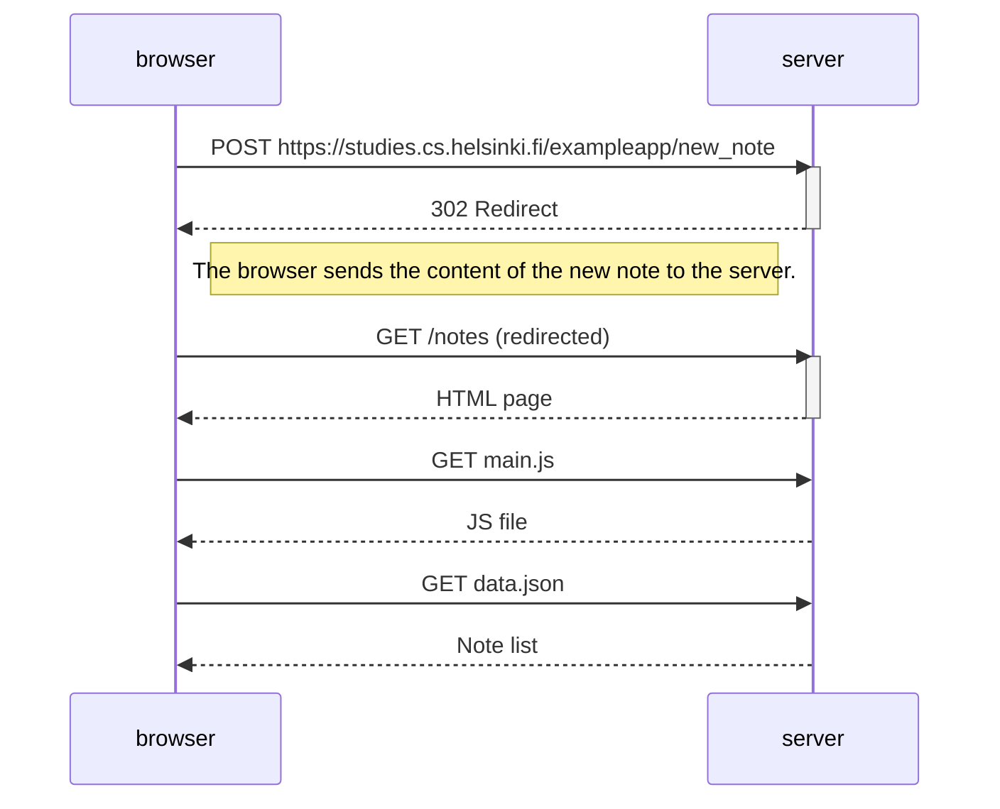

```mermaid
sequenceDiagram
    participant browser
    participant server

    browser->>server: POST https://studies.cs.helsinki.fi/exampleapp/new_note
    activate server
    server-->>browser: 302 Redirect
    deactivate server

    Note right of browser: The browser sends the content of the new note to the server.

    browser->>server: GET /notes (redirected)
    activate server
    server-->>browser: HTML page
    deactivate server

    browser->>server: GET main.js
    server-->>browser: JS file

    browser->>server: GET data.json
    server-->>browser: Note list
```
