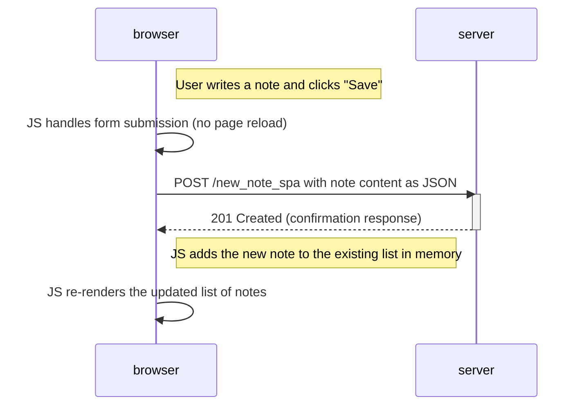

```mermaid
sequenceDiagram
    participant browser
    participant server

    Note right of browser: User writes a note and clicks "Save"

    browser->>browser: JS handles form submission (no page reload)

    browser->>server: POST /new_note_spa with note content as JSON
    activate server
    server-->>browser: 201 Created (confirmation response)
    deactivate server

    Note right of browser: JS adds the new note to the existing list in memory

    browser->>browser: JS re-renders the updated list of notes
```
